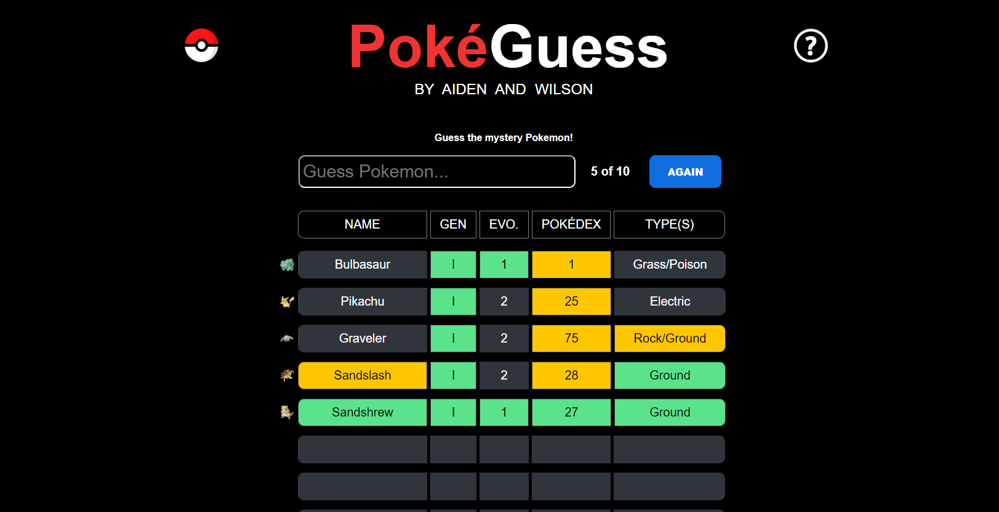

# PokeGuess
### A Pokémon guessing game, developed by [Aiden](https://github.com/AidenCarelse) and [Wilson](https://github.com/WilsoAgya)

*Pokeguess is currently a work in progress*

## About PokeGuess
PokeGuess is a personal project that combines our love of programming and Pokémon! Inspired by websites such as [Wordle](https://www.nytimes.com/games/wordle/index.html) and [MLB Pickle](https://www.mlbpickle.com/), PokeGuess lets users compete amongst themselves to see how quickly they can figure out the mystery Pokémon from an increasingly large database. The aim of the game is to guess the Pokémon in the fewest amount of tries possible. Each time a guess is made, more information is made available to the player. Not only will PokéGuess tell you when you have won, but it will also give you specific details regarding how similar the mystery Pokémon is to the one you guessed!

